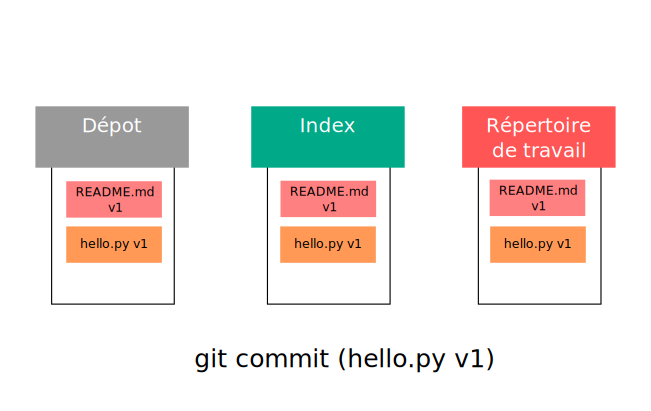
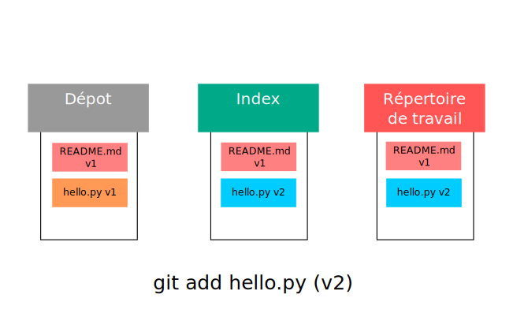
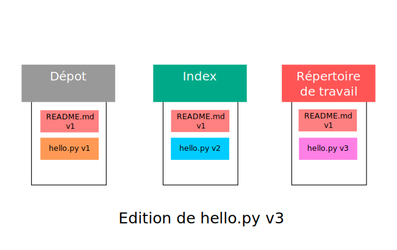

GIT comporte 3 espaces, on parle des 3 arbres de GIT:

*   le **répertoire de travail** (**workdir**, en anglais): c'est là que vous faites toutes vos modifications.
*   l'**index** (**index** ou **stage**, en anglais): zone de transit avant la validation des modifications.
*   le **dépot** (**repository**, en anglais): l'ensemble des modifications validées, reliées entre elles.

Hello world!
------------

Créez un nouveau fichier hello.py avec comme contenu:

    print "Hello world!"
    

Ajouter ce fichier dans l'index puis commitez-le.

Voici à quoi ressemblent les 3 espaces de votre projet:

**Note :** Pour tester votre programme, utilisez la commande `python hello.py`.

Ajout de la procédure 'ecrire()'
--------------------------------

Ajouter la function 'ecrire()', pour obtenir le contenu suivant :

    def ecrire(chaine):
        print chaine
    
    print "Hello world!"
    

Regardez l'état du dépôt:

    $ git status
    Sur la branche master
    Modifications qui ne seront pas validées :
      (utilisez "git add <fichier>..." pour mettre à jour ce qui sera validé)
      (utilisez "git checkout -- <fichier>..." pour annuler les modifications dans la copie de travail)
    
        modifié :         hello.py
    
    aucune modification n'a été ajoutée à la validation (utilisez "git add" ou "git commit -a")
    

Visualisez les modification apportées avec la commande `git diff` :

    $ git diff
    diff --git a/hello.py b/hello.py
    index ed708ec..6ae12ae 100644
    --- a/hello.py
    +++ b/hello.py
    @@ -1 +1,4 @@
    +def ecrire(chaine):
    +    print chaine
    +
     print "Hello world!"
    

Ajoutez la modification à l'index sans la valider pour l'instant (pas de commit) :

    $ git add hello.py
    $ git status
    Sur la branche master
    Modifications qui seront validées :
      (utilisez "git reset HEAD <fichier>..." pour désindexer)
    
        modifié :         hello.py
    

Remarquez que maintenant `git diff` ne voit aucune différence car, par défaut, il compare l'espace de travail avec l'index. Pour visualiser les différences entre l'index et le dernier commit, utilisez `git diff --staged` (pour rappel, le **stage** est l'espace d'index).

Votre dépot ressemble à cela:

Utilisation de 'ecrire()'
-------------------------

Modifier le programme pour utilisez la fonction `ecrire()` plutôt que `print()`, de la façon suivante :

    def ecrire(chaine):
        print chaine
    
    ecrire("Hello world!")
    

Affichez l'état courant :

    $ git status
    Modifications qui seront validées :
      (utilisez "git reset HEAD <fichier>..." pour désindexer)
    
        modifié :         hello.py
    
    Modifications qui ne seront pas validées :
      (utilisez "git add <fichier>..." pour mettre à jour ce qui sera validé)
      (utilisez "git checkout -- <fichier>..." pour annuler les modifications dans la copie de travail)
    
        modifié :         hello.py
    

On remarque ici 2 modifications sur notre fichier : une modification indexée (l'ajout de la fonction) et une autre non (l'utilisation de la fonction)

Visualisez les différences entre les espaces :

*   espace de travail <-> index (pour rappel : comportement par défaut de `git diff`)
*   index <-> dépot (dernier commit) (pour rappel : `git diff --staged`)
*   espace de travail <-> dépot

Voici la commande pour comparer l'espace de travail avec le dépôt (nous reviendrons plus tard sur la signification du mot clef `HEAD`) :

    $ git diff HEAD
    diff --git a/hello.py b/hello.py
    index ed708ec..320c425 100644
    --- a/hello.py
    +++ b/hello.py
    @@ -1 +1,4 @@
    -print "Hello world!"
    +def ecrire(chaine):
    +    print chaine
    +
    +ecrire("Hello world!")    
    

Remarquez que ce diff est la fusion des deux autres.

Chaque espace contient une version différente de fichier **hello.py** .

Pour garder un historique complet des actions que vous avez effectuées, vous allez bien séparer les choses :

*   la création de la fonction est dans l'index, on la valide premièrement : tapez `git commit`
*   puis on crée un commit pour son utilisation : tapez `git add hello.py` suivi de `git commit`.

Utilisez `git status` (n'hésitez pas à user et abuser de cette commande !) et `git diff` à chaque étape pour suivre ce qui ce passe.

Renommage et Suppression
------------------------

*   Ajouter un fichier non vide `fichier1` et commitez-le

Puis, observez ce que vous dit `git status` pour chacune des étapes suivantes :

    $ mv fichier1 fichier2
    $ git rm fichier1
    $ git add fichier2
    

Git détecte que les 2 fichiers (1 supprimé, 1 ajouté) ont le même contenu. Il en déduit que c'est un renommage.

Le renommage peut se faire aussi plus directement :

    $ git mv fichier1 fichier2
    

Commitez ce renommage.

*   Pour supprimer `fichier2`, 2 manières de faire :
    
    $ rm fichier2  
    $ git rm fichier2  
    $ git commit
    

Ou plus direct :

    $ git rm fichier2
    $ git commit