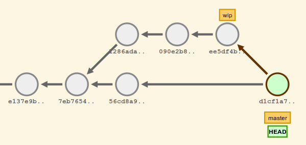

Révisions
---------

Nous avons vu qu'un certain nombre de commandes Git prennent en paramètre un identifiant de commit. Pour être plus exact, le paramètre attendu est une **_révision_**, qui dans la plupart des cas identifie un commit.

Il existe de nombreuses formes de **_révisions_** ; nous en avons vu quelques-unes :

*   un code SHA1 (complet ou abrégé) : dae86e1950b1277e545cee180551750029cfe735, dae86e
*   une référence symbolique : 'HEAD', 'wip', 'origin/master', ...
*   une étiquette : 'v1.0', 'v0.8RC2', ...
*   une reflog : 'stash@{0}', ...

À cela s'ajoute la possibilité de désigner un ancêtre, comme avec les notations 'HEAD^^' ou 'HEAD~5'.

Il existe bien d'autres formes de révisions, que vous pouvez retrouver dans une page de manuel dédiée accessible par : `git help gitrevisions`.

En lisant cette page de manuel, vous pourrez apprendre qu'il y a une différence entre 'HEAD^' et 'HEAD~' à laquelle nous n'avons pas prêtée attention jusqu'à présent.

Cette différence n'apparaît que sur les commits de fusion, qui comportent plusieurs parents ('d1cf1a7' dans la figure ci-dessous)

*   'HEAD^' est un raccourci de 'HEAD^1', et désigne le **1er parent** de 'HEAD', et donc le commit '56cd8a9'.
*   'HEAD^2' désigne le **2ème parent** de 'HEAD', et donc le commit 'ee5df4b'.
*   'HEAD~2' est l'équivalent de 'HEAD^^', qui est l'équivalent de 'HEAD^1^1', et désigne donc le **1er parent du 1er parent** ('7eb7654')
*   'HEAD^2~', équivalent de 'HEAD^2^1', désigne le **1er parent du 2ème parent**, et donc le commit '090e2b8'

Intervalles de révision
-----------------------

Certaines commandes Git opèrent (ou peuvent opérer) en parcourant un historique.

La plus classique est `git log <revision>`. Sous cette forme, tout l'historique depuis la racine jusqu'à la révision spécifiée est parcouru et affiché.

Il est possible, pour ces commandes, de spécifier l'intervalle de révisions à parcourir, en utilisant une notation telle que '..'.

Testez, par exemple, `git log HEAD~5..HEAD` pour limiter l'affichage de l'historique aux 5 derniers commits (`git log -n 5` donne le même résultat).

Une autre commande pour laquelle la spécification d'un intervalle peut être utile est `git diff`. Ainsi :

*   `git diff HEAD~2..HEAD` affiche les différences existantes entre l'antépénultième version et la version courante,
*   `git diff master..wip` affiche les différences entre la branche 'master' et la branche 'wip'

L'ordre dans lequel les révisions sont spécifiées est important : `git diff master..wip` affiche les modifications permettant de _passer_ de la version présente dans 'master' à la version présente dans 'wip'. `git diff wip..master` donnera donc l'exact opposé.

D'autres notations d'intervalle existent. Là aussi, consultez la page de manuel 'gitrevisions' à l'aide `git help gitrevisions`.