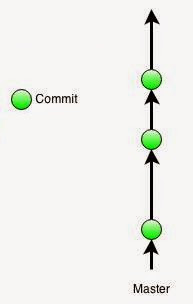
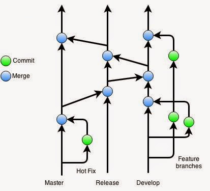
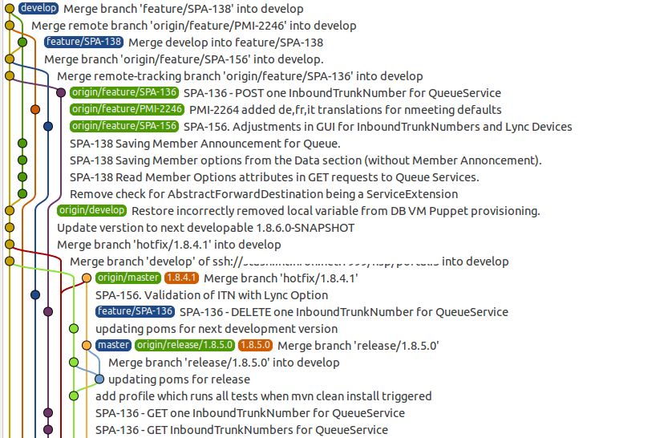
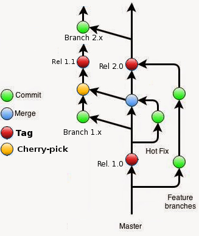
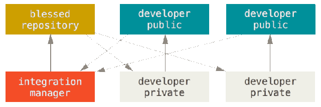
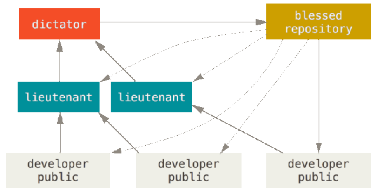

Exemples de workflow
====================

Préliminaire
------------

Si l'utilisation des branches est aisée et rapide avec Git, au point d'en faire un élément de base du processus d'écriture, la question se pose néanmoins de savoir quand il est intéressant de les utiliser et de quelle façon.

La question a d'autant plus de sens pour les projets collaboratifs, afin que tous les contributeurs utilisent et partagent la même méthodologie.

On trouve, parmi la communauté des utilisateurs Git, plusieurs propositions de **_workflow_** (en français, on peut parler d'_enchaînement des tâches_), des plus simples aux plus complexes. Le _workflow_ a mettre en place est principalement fonction des besoins du projet et de son ampleur, mais aussi éventuellement de l'écosystème auquel il appartient (par exemple, les applications _officielles_ Gnome utilisent, plus ou moins, le même type de workflow).

#### Pourquoi utiliser des branches ?

Vous vous demandez sûrement encore en quoi les branches sont utiles, en particulier pour un projet développé en solo. Prenons 2 cas réalistes, souvent rencontrés.

*   **Garder une version stable immédiatement accessible**
    
    Vous travaillez sur un projet nécessitant de longs développements, et régulièrement on vous demande de faire une démonstration, à l'impromptu.  
    La réponse est (trop) souvent : "_Désolé, mais je suis en train de faire des modifications, alors la démo ne fonctionne plus..._".  
    Avec Git, plus d'excuses : Assurez-vous de n'avoir sur la branche _master_ que des versions fonctionnelles de votre projet, et effectuez vos évolutions sur une branche. Lorsque que l'on vous demande une démo, un simple `git stash ; git checkout master` et le tour est joué !
    
*   **Évolutions nécessitant une validation**
    
    Vous êtes seul développeur, mais votre projet est utilisé par d'autres. Chaque évolution doit être validée par un groupe d'utilisateurs référents avant d'être mise _officiellement_ à disposition.  
    Cette validation peut prendre un _certain temps_ et pendant ce délai d'attente vous travaillez sur l'ajout ou l'amélioration d'autres fonctionnalités. Vos utilisateurs référents vont certainement vous demander quelques modifications sur la fonctionnalité qu'ils sont en train de tester.  
    Il semble assez naturel dans un cas comme celui-ci de dédier une branche à chaque fonctionnalité en cours d'évolution.  
    Pour créer une version de votre code à destination des testeurs, vous pouvez créer une branche à partir de la branche stable ('master', par exemple) et y fusionner les fonctionnalités à tester.  
    Lorsqu'une fonctionnalité est complétement validée, vous l'intégrez par fusion sur la branche stable.
    

Workflows usuels
----------------

Nous nous plaçons ici plutôt dans le contexte d'un projet collaboratif.

Les schémas présentés ci-après ne sont pas des historiques de commits. Ils décrivent une méthode de travail : de quelle manière les opérations de création et de fusion de branches sont enchaînées et pour quelle raison une branche est créée.  
Les historiques résultats peuvent être d'une forme différente, à cause, par exemple, de commits de fusion qui seront créés par des `git pull`, ou parce que vous effectuez un _rebasage_ de vos branches avant de les déposer.

Certaines des branches peuvent être partagées (présentes dans le dépôt pendant qu'elles sont en cours d'utilisation), ou non (branches uniquement locales). Le choix du partage d'une branche est dépendant des choix effectués par les responsables du projet et du degré de collaboration entre les contributeurs. Les _workflows_ ne fixent pas ces règles.

#### Master-only

Pour des projets simples, avec peu de contributeurs, l'utilisation de la seule branche 'master' peut convenir.

Il y a plusieurs implications :  
\- une seule personne travaille sur une évolution donnée  
\- il faut répartir le travail afin de limiter au maximum les risques de conflits  
\- la durée d'écriture d'une évolution doit être courte, là aussi pour éviter les risques de conflits

#### GitHub-flow

Le schéma précédent présente un inconvénient certain pour des développements _longs_, et ne permet pas de collaborer sur une évolution, ne serait-ce que pour permettre à un responsable de projet de _valider_ des modifications avant de les intégrer.

Il ne permet pas non plus de _laisser temporairement de côté_ une évolution pour travailler sur une fonctionnalité plus urgente à intégrer (il y a bien sûr la possibilité de faire du _remisage_, mais nous parlons ici de principes de méthode de travail).

Un _workflow_ plus courant consiste à utiliser des '_feature branches_'.  
Il se base sur la méthode suivante :  
\- à tout moment la version disponible sur la branche 'master' est stable et donc déployable  
\- une branche est créée à partir de 'master' pour toute modification, quelle que soit son ampleur  
\- régulièrement cette branche est poussée sur une branche du même nom sur le serveur  
\- quand nécessaire, un responsable du projet valide les modifications  
\- la branche est fusionnée sur 'master' et est poussée sur le serveur

Cette méthode a pris le nom de '_github-flow_' car c'est celle utilisée par les développeurs du service GitHub, et celle qui est naturellement mise en oeuvre lorsque l'on utilise un service tel que GitHub offrant les fonctions de fork/pull request.

#### Gitflow

L'inconvénient, pour certains projets, du schéma précédent est la présence sur la branche 'master' de _micro-évolutions_. Il peut être préférable de ne déposer sur 'master' que des versions _livrables complètes_ (des _releases_).

Un schéma plus complexe est dans ce cas nécessaire. Le _workflow_ portant le nom de **_gitflow_** a été proposé en ce sens par [Vincent Driessen](http://nvie.com/posts/a-successful-git-branching-model/). Il contient :  
\- une branche 'develop' qui correspond à la branche 'master' du 'github-flow'  
\- les _releases_ sont préparées sur une branche spécifique (fusion depuis la branche 'develop' jusqu'à ce que la _release_ soit validée)  
\- lorsqu'une _release_ est prête, elle est fusionnée sur la branche 'master'

La correction d'un bug critique est fusionnée directement sur la branche 'master' et déployée sur les branches 'release' et 'develop'.

Ce _workflow_ est utilisé par de nombreux projets (d'une certaine ampleur...) et a donné lieu au développement d'une extension Git pour faciliter sa mise en oeuvre (voir [https://github.com/nvie/gitflow](https://github.com/nvie/gitflow)).

Si il a été largement adopté, ce _workflow_ a également ses détracteurs, à cause de la complexité de l'historique qu'il génère (ci-dessous). Chacun se fera son avis...

#### Workflow intermédiaire

De nombreux projets adoptent un _workflow_ de complexité intermédiaire, conservant la simplicité du _GitHub-flow_ tout en prenant en compte la gestion des _releases_ :  
\- la branche 'master' contient la version (stable !) en cours de développement  
\- l'ajout/modification de fonctionnalités et la correction de bug sont réalisées sur des branches spécifiques  
\- lorsque la version en cours peut-être _diffusée_ (création d'une _release_), une étiquette est apposée sur la branche 'master' et une '_release-branch_' est créée.

Chaque _release_ ayant sa propre branche, elle peut continuer à évoluer, par exemple pour y ajouter la correction d'un bug ou améliorer une fonctionnalité, jusqu'à la parution de la prochaine _release_. On évitera, si possible, de faire diverger les '_release-branches_' en ne les utilisant que pour maintenir, pendant quelque temps, une ancienne version. Gérer et maintenir à long terme de multiples versions d'un même code est source de difficultés.

_Note :_ La commande `git cherry-pick` est généralement utilisée, avec ce _workflow_, pour reporter, par exemple, une correction de bug de la branche 'master' sur une '_release-branch_'. Le 'cherry-pick' n'intégrera **que** le seul commit correspondant à la correction de bug, alors qu'un 'merge' intégrerait toute la séquence de commits séparant la tête de la '_release-branch_' du commit de résolution du bug (ce qui n'est généralement pas le but recherché).

Workflow et rôles
-----------------

Puisque dans ce chapitre nous évoquons des sujets liés à la gestion d'un projet collaboratif, c'est la bonne occasion pour aborder la question des rôles des contributeurs et de leurs droits d'accès.

Le serveur Git en lui-même ne gère pas les droits d'accès, il laisse cela au système d'exploitation (accès par ssh) ou au serveur Web (accès par http). Ainsi tout utilisateur qui a les droits d'accès en écriture à un dépôt a la possibilité de pousser des commits sur n'importe quelle branche, y compris les branches de _releases officielles_ !

En général, on ne veut laisser le _droit de commit_ sur la branche 'master' qu'à un nombre restreint de contributeurs _de confiance_ (le laisseriez-vous à des étudiants en stage ?). Les rôles sont alors répartis en trois niveaux (minimum) :

1.  les contributeurs ne poussent que sur des branches spécifiques
2.  les modifications sont vérifiées par des personnes en charge de la validation
3.  un responsable de l'intégration réalise la fusion des modifications validées

Cette répartition et les droits qui lui sont associés n'étant pas gérés **directement** par Git, il faut passer par un _contournement_. Deux méthodes sont utilisables :

*   Utiliser une surcouche au serveur Git permettant de gérer _finement_ les droits d'accès aux branches
    
    [gitolite](http://gitolite.com/gitolite/index.html) est un exemple de surcouche, simple à mettre en oeuvre sur un serveur Git standard.  
    La plupart des fournisseurs de dépôts (tel que Gitlab) intègrent également cette possibilité.
    
*   Utiliser les possibilités offertes par la décentralisation
    
    Nous avons vu dans le chapitre sur [les Branches distantes](../branchesdistantes/) qu'il est possible de _connecter_ un dépôt local à plusieurs dépôts distants. C'est la fonctionnalité qui va être utilisée pour gérer les différents rôles.
    

#### Contributeurs et responsable d'intégration

(sur ce schéma, les blocs du haut représentent des dépôts stockés sur un (ou des) serveur(s), les blocs du bas représentent les dépôts locaux de chacun)

Le dépôt officiel n'est accessible en écriture que par le (ou les) responsable(s) d'intégration.  
Chaque contributeur dispose de son propre dépôt _public_ (accessible en lecture par les autres contributeurs).

Les contributeurs effectuent des _pulls_ depuis le dépôt officiel, et poussent leurs modifications sur leur dépôt personnel.

Le responsable d'intégration ajoute en _remote_ le dépôt des contributeurs, fusionne les modifications sur son dépôt local, puis pousse sur le dépôt officiel.

**Note :** Ce mode de fonctionnement est celui qui est mis en oeuvre, de manière presque transparente, par le concept de fork/pull-request popularisé par le service GitHub.

#### Contributeurs, lieutenants et dictateur

L'activité de validation des modifications proposées par les contributeurs peut être très difficile à mener, pour des raisons de temps qu'elle demande ou de niveau d'expertise nécessaire.

Dans des projets complexes, comme Linux, un niveau intermédiaire peut être ajouté au schéma précédent : des _lieutenants_ sont en charge d'expertiser, valider et fusionner sur leur dépôt, certaines parties du code. Le _dictateur_ utilise les dépôts des _lieutenants_ pour nourrir le dépôt officiel.

À adopter si nécessaire... mais le cas précédent est le plus courant.