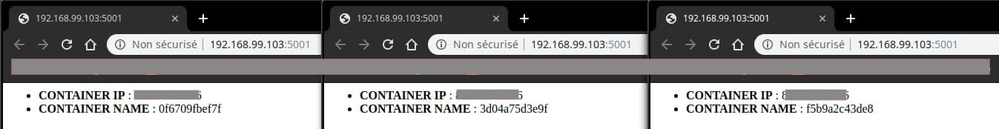

Dictionnaire Docker Swarm
-------------------------

Aujourd'hui nous allons nous intéresser à ma partie préférée dans Docker à savoir Docker Swarm.

### C'est quoi un Docker Swarm ? Manager Swarm ? Les nœuds ? Les workers ?

Un Swarm est un groupe de machines exécutant le moteur Docker et faisant partie du même cluster. Docker swarm vous permet de lancer des commandes Docker auxquelles vous êtes habitué sur un cluster depuis une machine maître nommée **manager/leader Swarm**. Quand des machines rejoignent un Swarm, elles sont appelés **nœuds**.

Les managers Swarm sont les seules machines du Swarm qui peuvent exécuter des commandes Docker ou autoriser d’autres machines à se joindre au Swarm en tant que **workers**. Les workers ne sont là que pour **fournir de la capacité** et n'ont pas le pouvoir d'ordonner à une autre machine ce qu'elle peut ou ne peut pas faire.

Jusqu'à présent, vous utilisiez Docker en mode hôte unique sur votre ordinateur local. Mais Docker peut également être basculé en mode swarm permettant ainsi l'utilisation des commandes liées au Swarm. L'activation du mode Swarm sur hôte Docker fait instantanément de la machine actuelle un manager Swarm. À partir de ce moment, Docker exécute les commandes que vous exécutez sur le Swarm que vous gérez, plutôt que sur la seule machine en cours.

### C'est quoi un service ? une task (tâche) ?

Dans le vocabulaire Swarm nous ne parlons plus vraiment de conteneurs mais plutôt de **services**.

Un service n'est rien d'autre qu'une description de l'état souhaité pour vos conteneurs. Une fois le service lancé, une **tâche** est alors attribuée à chaque nœud afin d'effectuer le travail demandé par le service.

Nous verrons plus loin les détails de ces notions, mais histoire d'avoir une idée sur **la différence entre une tâche et un service**, nous allons alors imaginer l'exemple suivant :

Une entreprise vous demande de déployer des conteneurs d'applications web. Avant toute chose, vous allez commencer par définir les caractéristiques et les états de votre conteneur, comme par exemple :

*   Trois conteneurs minimums par application afin de supporter des grandes charges de travail
*   Une utilisation maximale de 100 Mo de mémoire pour chaque conteneur
*   les conteneurs se baseront sur l'image httpd
*   Le port 8080 sera mappé sur le port 80
*   Redémarrer automatiquement les conteneurs s'ils se ferment suite à une erreur

Pour le moment vous avez défini l'état et les comportements de vos conteneurs dans votre service, par la suite quand vous exécuterez votre service, chaque nœud se verra attribuer alors une ou plusieurs tâches jusqu'à satisfaire les besoins définit par votre service.

### Résumons les différents concepts de Docker Swarm

Il est important au préalable de bien comprendre la définition de chaque concept afin d'assimiler facilement le fonctionnement global de Docker Swarm. Je vais donc vous résumer toutes ces notions à travers un seul exemple :

Imaginez que vous êtes embauché en tant qu'ingénieur système dans une start-up. Les développeurs de l'entreprise décident un jour de vous fournir les sources de leur application web tournant sous le serveur web nginx. Votre chef de projet vous demande alors de lui expliquer le process de déploiement de l'application web dans un Cluster Swarm. Comme vous êtes un trés bon ingénieur 😎, vous lui expliquez les étapes suivantes :

*   Un service sera créé dans lequel nous spécifierons qu'elle sera image utilisée et nous estimerons quelles seront les charges de travail suffisantes pour les conteneurs qui seront en cours d'exécution.
*   La demande sera ensuite envoyée au manager Swarm (leader) qui planifie l'exécution du service sur des nœuds particuliers.
*   Chaque nœud se voit assigné une ou plusieurs tâche(s) en fonction de l'échelle qui a été définie dans le service.
*   Chaque tâche aura un cycle de vie, avec des états comme NEW , PENDING et COMPLETE.
*   Un équilibreur de charge sera mis en place automatiquement par votre manager Swarm afin de supporter les grandes charges de travails.

Voici un schéma qui reprend les étapes citées précédemment :

Créer d'un cluster Swarm
------------------------

### Création des nœuds

Dans le [chapitre précedent](https://devopssec.fr/article/deployer-gerer-vos-hotes-docker-avec-docker-machine) , nous avons vu comment déployer des machines Docker avec l'outil Docker Machine. Nous allons réutiliser cet outil de façon à créer deux VMs avec le driver virtualbox.

    docker-machine create --driver virtualbox --virtualbox-no-vtx-check mymanager

    docker-machine create --driver virtualbox --virtualbox-no-vtx-check worker

Vous avez maintenant créé deux machines virtuelles, nommées mymanager et worker qu'on utilisera plus tard en tant que nœuds dans notre Swarm. Nous allons exploiter la première machine virtuelle mymanager en tant que manager Swarm et l'autre machine sera un nœud de travail.

Nous aurons besoin maintenant de récupérer les IPs de ces nouvelles machines à l'aide de la commande suivante :

    docker-machine ls

Résultat :

    NAME        ACTIVE   DRIVER       STATE     URL                         SWARM   DOCKER     ERRORS
    mymanager   -        virtualbox   Running   tcp://192.168.99.103:2376           v18.09.8   
    worker      -        virtualbox   Running   tcp://192.168.99.104:2376           v18.09.8   

Nous avons donc :

*   mymanager avec l'ip 192.168.99.103.
*   worker avec l'ip 192.168.99.104.

### Activer le mode swarm

L’avantage de Docker Swarm est qu'il est déjà intégré dans Docker par défaut, donc pas besoin d'installation supplémentaire.

Dans cette partie, nous allons activer le mode Swarm sur la machine Docker mymanager de la même manière elle deviendra la leader de notre Swarm. Pour ce faire, nous utiliserons la commande docker-machine ssh.

Voici la **commande qui permet d'activer le mode Swarm** sur une machine d'un Swarm :

    docker-machine ssh mymanager "docker swarm init --advertise-addr 192.168.99.103"

Résultat :

    Swarm initialized: current node (seyml9rjc3bo5eozlijjx7jgr) is now a manager.
    
    To add a worker to this swarm, run the following command:
    
        docker swarm join --token SWMTKN-1-1368nlbw9syzrliv44956cvp9b1g5ivmr2rmu5g238g7q1bro7-1rutjgzngabbv2jx7dlrjnqlr 192.168.99.103:2377
    
    To add a manager to this swarm, run 'docker swarm join-token manager' and follow the instructions.

Votre cluster Swarm est prêt maintenant à accueillir de nouvelles machines. De plus, le résultat nous indique clairement comment rajouter une machine à notre Swarm, et c'est exactement ce que nous allons faire dans la prochaine étape.

### Joindre une machine au cluster Swarm

Pour **ajouter un travailleur à un swarm**, exécutez la commande suivante :

    docker-machine ssh worker "docker swarm join \
    --token SWMTKN-1-1368nlbw9syzrliv44956cvp9b1g5ivmr2rmu5g238g7q1bro7-1rutjgzngabbv2jx7dlrjnqlr 192.168.99.103:2377"

Résultat :

    This node joined a swarm as a worker.

Voici la commande qui permet d'**afficher les différents nœuds de votre Swarm** :

    docker-machine ssh mymanager "docker node ls"

Résultat :

    ID                            HOSTNAME            STATUS              AVAILABILITY        MANAGER STATUS      ENGINE VERSION
    seyml9rjc3bo5eozlijjx7jgr *   mymanager           Ready               Active              Leader              18.09.8
    i7f61zqyqfadzm01oj9w675ew     worker              Ready               Active                                  18.09.8

D'ailleurs le résultat nous indique formellement dans la colonne MANAGER STATUS que c'est le nœud mymanager le Big Boss 💪.

Rappel

Rappelez-vous que seuls les managers du Swarm comme mymanager exécutent les commandes Docker, les workers ne sont là juste pour fournir de la capacité.

Félicitations, vous venez de créer votre premier cluster Swarm !

### Configurer le shell de notre manager Swarm

Jusqu'à présent, nous utilisions des commandes Docker en ssh afin de les exécuter sur le nœud manager. Ce n'est pas vraiment pratique comme solution, en vue de nous faciliter la vie, désormais nous chargerons les variables d'environnements de notre leader Swarm sur notre shell courant, dès lors toutes les prochaines commandes docker lancées depuis le shell courant s'exécuteront directement sur la machine mymanager.

Commençons par récupérer les variables d'environnements de notre nœud mymanager :

    docker-machine env mymanager

Résultat :

    export DOCKER_TLS_VERIFY="1"
    export DOCKER_HOST="tcp://192.168.99.100:2376"
    export DOCKER_CERT_PATH="/home/hatim/.docker/machine/machines/mymanager"
    export DOCKER_MACHINE_NAME="mymanager"
    # Run this command to configure your shell: 
    # eval $(docker-machine env mymanager)

La commande suivante, permet de **configurer votre shell** pour lui permettre de communiquer avec le nœud mymanager :

    eval $(docker-machine env mymanager)

Vérifions maintenant que c'est bien le nœud mymanager qui est actif :

    docker-machine active

Résultat :

    mymanager

Dorénavant, plus besoin de lancer vos commandes en ssh depuis votre shell courant pour communiquer avec le nœud mymanager.

Déployer une application à service individuel dans un Swarm avec Docker Service
-------------------------------------------------------------------------------

### Créer un service

La commande docker service est utilisée lors de la **gestion d'un service individuel dans un cluster Swarm**.

Voici une idée de ce qu'un service peut définir comme comportement et état d'un conteneur :

*   Le nom de l'image et le tag que les conteneurs du nœud doivent exécuter.
*   Combien de conteneurs participent au service.
*   Les ports à exposer à l'extérieur du cluster Swarm.
*   Comment doit agir le conteneur suite à une erreur.
*   Les caractéristiques des nœuds sur lesquels le service peut s'exécuter (telles que des contraintes de ressources et ou de préférence de placement sur tel ou tel nœud).
*   etc ...

C'est déjà pas mal non ? Pour l'exemple ci-dessous, on souhaite spécifier les comportements suivants :

*   Un conteneur qui se base une image [stable-alpine](https://hub.docker.com/_/nginx).
*   Trois conteneurs doivent être exécutés au minimum.
*   Redémarrez le conteneur s'il se ferme suite à une erreur.
*   Limiter l'utilisation de la mémoire à 100 Mo
*   Mapper le porte 5001 sur le port 5000

Ci-dessous la **commande qui crée un service** avec ses options respectant les caractéristiques définis plus haut :

    docker service create --name nginx \
    --replicas 3 \
    --publish published=5001,target=5000 \
    --restart-condition=on-failure \
    --limit-memory	100M \
    nginx:stable-alpine

Résultat :

    4xp37ly8dedy0fyqn3jvocpyv
    overall progress: 3 out of 3 tasks 
    1/3: running   [==================================================>] 
    2/3: running   [==================================================>] 
    3/3: running   [==================================================>] 

Vous pouvez **connaître l'état d'avancement du service dans votre Swarm** en lançant la commande suivante :

    docker service ls

Résultat :

    ID                  NAME                MODE                REPLICAS            IMAGE                  PORTS
    4xp37ly8dedy        flaskc              replicated          3/3                 hajdaini/flask:first   *:5001->5000/tcp

Vous pouvez également **lister les différentes tâches de votre service** afin de vérifier par exemple sur quel nœud s'est exécutée votre tâche.

    docker service ps flaskc

Résultat :

    ID                  NAME                IMAGE                  NODE                DESIRED STATE       CURRENT STATE                ERROR               PORTS
    5prkwtd89c7i        flaskc.1            hajdaini/flask:first   mymanager           Running             Running about a minute ago                       
    kmksj0834v81        flaskc.2            hajdaini/flask:first   mymanager           Running             Running about a minute ago                       
    fee27ez96y8d        flaskc.3            hajdaini/flask:first   worker              Running             Running about a minute ago

Selon le résultat nous avons deux répliques dans le nœud mymanager et une seule réplique dans le nœud worker

### Accéder à votre cluster

Actuellement, nous avons trois de conteneurs tournant dans notre Swarm, tous cyclant de manière aléatoire, grâce à un **équilibreur de charge créée automatiquement par Swarm**. Oui oui, vous n'avez pas besoin de configurer un Load Balancer, Swarm s'occupe de tous.

Vous ne me croyez pas ? J'ai faits exprès sur mon image flask d'afficher le hostname du conteneur, par défaut le hostname du conteneur équivaut à son ID. Nous allons récupérer les IDs de tous nos conteneurs grâce aux commandes suivantes :

Je commence par afficher l'ID des conteneurs de mon nœud mymanager :

    docker ps

Résultat :

    CONTAINER ID        IMAGE                  COMMAND             CREATED             STATUS              PORTS               NAMES
    3d04a75d3e9f        hajdaini/flask:first   "python app.py"     26 minutes ago      Up 26 minutes       5000/tcp            flaskc.2.kmksj0834v81edg1l8wf7ujr6
    f5b9a2c43de8        hajdaini/flask:first   "python app.py"     26 minutes ago      Up 26 minutes       5000/tcp            flaskc.1.5prkwtd89c7ij8wegh41d17b5

Je récupère ensuite l'ID des conteneurs de mon nœud worker :

    docker-machine ssh worker "docker ps"

Résultat :

    CONTAINER ID        IMAGE                  COMMAND             CREATED             STATUS              PORTS               NAMES
    0f6709fbef7f        hajdaini/flask:first   "python app.py"     29 minutes ago      Up 29 minutes       5000/tcp            flaskc.3.fee27ez96y8dm7vei5e5hnnd7

Pour résumer nous avons :

*   3d04a75d3e9f : ID du premier conteneur du nœud mymanager.
*   f5b9a2c43de8 : ID du deuxième conteneur du nœud mymanager.
*   0f6709fbef7f : ID du conteneur du nœud worker.

Nous allons accéder à notre application à partir de l'adresse IP du nœud mymanager (vous pouvez utiliser également l'IP du nœud worker) afin de vérifier le hostname récupéré par la page, voici mes résultats sous forme de Screenshots :

On peut clairement constater que tous les conteneurs du cluster sont appellés de manière aléatoire grâce à l'équilibreur de charge mis en place par Swarm.

### Mise à l’échelle de votre service

Votre application revendique encore plus de puissance ? Pas de soucis, voici la commande qui permet de **scaler automatiquement vos conteneurs sans les redémarrer** :

    docker service scale flaskc=5

Résultat :

    flaskc scaled to 5
    overall progress: 5 out of 5 tasks 
    1/5: running   [==================================================>] 
    2/5: running   [==================================================>] 
    3/5: running   [==================================================>] 
    4/5: running   [==================================================>] 
    5/5: running   [==================================================>] 
    verify: Service converged

Vérifions maintenant le nombre de tâches de nos nœuds afin de s'assurer du nombre de répliques

    docker service ps flaskc

Nous avons bien cinq répliques et non plus trois :

    ID                  NAME                IMAGE                  NODE                DESIRED STATE       CURRENT STATE               ERROR               PORTS
    5prkwtd89c7i        flaskc.1            hajdaini/flask:first   mymanager           Running             Running about an hour ago                       
    kmksj0834v81        flaskc.2            hajdaini/flask:first   mymanager           Running             Running about an hour ago                       
    fee27ez96y8d        flaskc.3            hajdaini/flask:first   worker              Running             Running about an hour ago                       
    zx2f23b0pfbs        flaskc.4            hajdaini/flask:first   worker              Running             Running 36 seconds ago                          
    0rk6dsp4bnqf        flaskc.5            hajdaini/flask:first   worker              Running             Running 36 seconds ag

### Mettre à jour votre service

Il est possible de **mettre à jour votre application depuis votre nouvelle image sans interruption de service**.

Dans cet exemple, je vais simuler une nouvelle version de notre application grâce à ma nouvelle image que j'ai poussée dans le [Docker Hub](https://cloud.docker.com/repository/docker/hajdaini/flask) :

    docker service update --image hajdaini/flask:second flaskc

    flaskc
    overall progress: 5 out of 5 tasks 
    1/5: running   [==================================================>] 
    2/5: running   [==================================================>] 
    3/5: running   [==================================================>] 
    4/5: running   [==================================================>] 
    5/5: running   [==================================================>] 
    verify: Service converged 

Sans aucune interruption de service, nous avons pu mettre à jour 5 conteneurs déployés sur différents nœuds et ceci depuis une seule commande ! Je pense que vous commencez maintenant à comprendre la puissance de Docker Swarm 🤩.

### Supprimer votre service

Vous n'avez plus besoin de votre service ? Aucun problème, vous pouvez utiliser la commande suivante pour **supprimer votre service** :

    docker service rm flaskc

Déployer une application multi-services dans un Swarm avec Docker stack
-----------------------------------------------------------------------

Docker Stack peut être utilisée pour **gérer une application multi-services dans votre cluster Swarm**. Pour faire simple, vous pouvez considérer que la commande docker service est identique à la commande docker run et que la commande docker stack est comparable à la commande docker-compose.

Nous allons utiliser les super pouvoirs de notre nœud mymanager pour déployer nos applications Docker multi-services dans notre cluster Swarm.

Comme pour la création de notre service précédemment, nous allons définir les différentes caractéristiques de nos conteneurs :

*   Deux API sous forme de deux services différents.
*   Trois conteneurs par service doivent être exécutés au minimum.
*   Redémarrez les services s'il se ferme suite à une erreur.
*   Limiter l'utilisation de la mémoire à 50 MO.
*   La première API écoute sur le port 5000 mais la deuxième API utilise le port 5001 comme port cible et le port 5000 comme port source.

Pas besoin d'apprendre de nouvelles choses pour créer nos services, car nous allons réutiliser les connaissances vues dans les chapitres précédents puisqu'il suffit juste de créer un fichier docker-compose.yml :

    version: "3"
    services:
        api1:
        image: hajdaini/flask:api1
        deploy:
            replicas: 3
            resources:
                limits:
                    memory: 50M
            restart_policy:
                condition: on-failure
        ports:
            - "5000:5000"
    
        api2:
        image: hajdaini/flask:api2
        deploy:
            replicas: 3
            resources:
                limits:
                    memory: 50M
            restart_policy:
                condition: on-failure
        ports:
            - "5001:5000"

La commande suivante permet de **déployer votre application multi-services dans votre Swarm** :

    docker stack deploy -c docker-compose.yml api-app

Résultat :

    Creating network api-app_default
    Creating service api-app_api1
    Creating service api-app_api2

Les commandes de Docker Stack restent très identiques aux commandes docker services , par exemple pour lister les différentes tâches dans votre Swarm, vous utiliserez la commande suivante :

    docker stack ps api-app

Résultat :

    ID                  NAME                IMAGE                 NODE                DESIRED STATE       CURRENT STATE            ERROR               PORTS
    t6gxznwnyfhu        api-app_api2.1      hajdaini/flask:api2   mymanager           Running             Running 43 seconds ago                       
    dbfee0mr8zgx        api-app_api1.1      hajdaini/flask:api1   worker              Running             Running 47 seconds ago                       
    qbof56ucped8        api-app_api2.2      hajdaini/flask:api2   worker              Running             Running 43 seconds ago                       
    keggmag2rfvb        api-app_api1.2      hajdaini/flask:api1   worker              Running             Running 47 seconds ago                       
    ok1prslxmq6o        api-app_api2.3      hajdaini/flask:api2   mymanager           Running             Running 43 seconds ago                       
    w342dvn3q934        api-app_api1.3      hajdaini/flask:api1   mymanager           Running             Running 47 seconds ago 

D'après le résultat, on peut s'apercevoir que nous avons bien deux services distincts avec trois répliques pour chaque service.

Même chose, pour accéder à nos services on peut utiliser soit l'adresse IP du nœud mymanager ou l'IP du nœud worker :

    curl http://192.168.99.103:5000/api1

Résultat :

    Bonjour, je suis l'api 1

* * *

    curl http://192.168.99.103:5001/api2

Résultat :

    Bonjour, je suis l'api 2

À partir de là, vous pouvez faire tout ce que vous avez appris dans les anciens chapitres et mettre à l'échelle votre application en modifiant simplement le fichier docker-compose.yml et d'exécuter simplement à nouveau la commande docker stack deploy pour prendre en compte vos nouvelles modifications.

Autre chose, si jamais vous rajoutez une nouvelle machine dans votre Swarm, il suffit juste de relancer la commande docker stack deploy pour que votre application tire parti des nouvelles ressources de votre nouveau nœud.

Si vous n'avez plus besoin de votre pile, vous pouvez alors la supprimer grâce à la commande suivante :

    docker stack rm api-app

Conclusion
----------

Je pense que comme moi vous êtes vraiment impressionné par la simplicité d'utilisation du Docker Swarm. L'un des plus gros avantage de Docker Swarm, c'est qu'il vous permet de vous concentrer sur le développement votre application et de ne pas vous soucier de l’endroit où cette dernière va s’exécuter. De plus les services sont constamment monitorés par Swarm. En plus du monitoring, Docker Swarm se charge de la **réparation automatique**, vous aidant ainsi à garder vos services de votre cluster en bon état de fonctionnement en comparant en permanence l’état désiré avec l’état actuel.

Docker Swarm offre d'autres fonctionnalités et je vous suggère de creuser davantage dans la documentation officielle. Pour information ce n'est pas le seul orchestrateur de conteneurs qui éxiste dans le marché, vous pouvez par exemple aussi vous intéresser à [Kubernetes](https://kubernetes.io/fr/), je compte d'ailleurs faire un cours dessus prochainement.

Comme à mon habitude, voici un **récapitulatif des commandes Docker Swarm** vu ensemble :

    # Gestion du cluster Swarm
    docker swarm
    
    # Gestion des conteneurs uni-service
    docker service
    
    # Gestion des conteneurs multi-services
    docker stack
    
    # Gestion des nœuds
    docker node

    # Activer le mode Swarm
    docker swarm init
    
    # Joindre une machine au cluster Swarm
    docker swarm join --token <token> <myvm ip>:<port>
    
    
    # -----------------------------------------------------------
    
    
    # Lister les différents nœuds de votre Swarm 
    docker node ls
    
    # Inspecter un nœud
    docker node inspect <NODE NAME> 
        --pretty : meilleur effet visuel
    
    # Retirer un nœud de votre Swarm (ne supprime pas la VM)
    docker node rm <NODE NAME>
        -f ou --force : forcer la suppression
    
    
    # -----------------------------------------------------------
    
    
    # Créer un service
    docker service create <IMAGE NAME>
        --name : nom du service
        --replicas <number> : nombre de tâches
        --publish published=<cible>,target=<source> : mapper un port
        --restart-condition=<conditon> : condition de redémarrage en cas d'erreur
        --limit-memory <number> : limiter l'utilisation de la mémoire
        --limit-cpu <number> : limiter l'utilisation du CPU
    
    # Visualiser l'état d'avancement de vos services Swarm 
    docker service ls
    
    # lister les différentes tâches de votre service 
    docker service ps <SERVICE NAME>
    
    # Mise en échelle des répliques de votre service
    docker service scale <SERVICE NAME>=<NUMBER>
    
    # Mise à jour de des conteneurs de votre service
    docker service update --image <IMAGE NAME>:<TAG> <SERVICE NAME>
    
    # Supprimer un service
    docker service rm flaskc
    
    
    # -----------------------------------------------------------
    
    
    # Déployer une nouvelle pile ou met à jour une pile existante
    docker stack deploy -c <Docker Compose File> <STACK NAME>
    
    # Lister tous les services de votre pile
    docker stack services <STACK NAME>
    
    # Répertorier les tâches de la pile
    docker stack ps <STACK NAME>
    
    # Supprimer tous les services de votre pile
    docker stack rm <STACK NAME>
    
    # Lister le nombre de services de votre pile
    docker stack ls