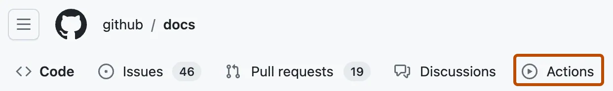

Création et test du code Python
===============================

Vous pouvez créer un workflow d’intégration continue (CI) pour générer et tester votre projet Python.

Dans cet article
----------------

*   [Introduction](#introduction)
*   [Prérequis](#prerequisites)
*   [Utilisation d’un workflow de démarrage pour Python](#using-a-python-starter-workflow)
*   [Spécification d’une version de Python](#specifying-a-python-version)
*   [Installer les dépendances](#installing-dependencies)
*   [Test de votre code](#testing-your-code)
*   [Empaquetage des données de workflow en tant qu’artefacts](#packaging-workflow-data-as-artifacts)
*   [Publication dans des registres de package](#publishing-to-package-registries)

[Introduction](#introduction)
-----------------------------

Ce guide explique comment générer, tester et publier un package Python.

Les exécuteurs hébergés dans GitHub ont un cache d’outils où sont préinstallés des logiciels, notamment Python ou PyPy. Vous n’avez donc rien à installer ! Pour obtenir la liste complète des logiciels les plus récents et des versions préinstallées de Python et PyPy, consultez « [Utilisation des exécuteurs hébergés par GitHub](/fr/actions/using-github-hosted-runners/about-github-hosted-runners#supported-software) ».

[Prérequis](#prerequisites)
---------------------------

Vous devez être familiarisé avec YAML et la syntaxe GitHub Actions. Pour plus d’informations, consultez « [Découvrir GitHub Actions](/fr/actions/learn-github-actions) ».

Il est recommandé de connaître les bases de Python et pip. Pour plus d’informations, consultez l’article suivant :

*   [Bien démarrer avec Python](https://www.python.org/about/gettingstarted/)
*   [Gestionnaire de package pip](https://pypi.org/project/pip/)

[Utilisation d’un workflow de démarrage pour Python](#using-a-python-starter-workflow)
--------------------------------------------------------------------------------------

Pour commencer rapidement, ajoutez le workflow de démarrage à l’annuaire `.github/workflows` de votre référentiel.

GitHub fournit un flux de travail de départ pour Python qui devrait fonctionner si votre référentiel contient déjà au moins un fichier `.py`. Les sections suivantes de ce guide donnent des exemples de la façon dont vous pouvez personnaliser ce workflow de démarrage.

1.  Dans GitHub.com, accédez à la page principale du dépôt.
    
2.  Sous le nom de votre dépôt, cliquez sur **Actions**.
    
    
    
3.  Si vous disposez déjà d’un workflow dans votre dépôt, cliquez sur **Nouveau workflow**.
    
4.  La page « Choisir un workflow » présente une sélection de workflows de démarrage recommandés. Recherchez « application Python ».
    
5.  Dans le workflow « Application Python », cliquez sur **Configurer**.
    
6.  Modifiez le workflow en fonction des besoins. Par exemple, modifiez la version de Python.
    
7.  Cliquez sur **Valider les changements**.
    

Le fichier de workflow `python-app.yml` est ajouté à l’annuaire `.github/workflows` de votre référentiel.

[Spécification d’une version de Python](#specifying-a-python-version)
---------------------------------------------------------------------

Pour utiliser une version préinstallée de Python ou de PyPy sur un exécuteur hébergé dans GitHub, utilisez l’action `setup-python`. Cette action recherche une version spécifique de Python ou de PyPy dans le cache d’outils de chaque exécuteur, et ajoute les fichiers binaires nécessaires à `PATH`, qui est conservé pour la suite du travail. Si une version spécifique de Python n’est pas préinstallée dans le cache d’outils, l’action `setup-python` télécharge et configure la version appropriée à partir du dépôt [`python-versions`](https://github.com/actions/python-versions).

L’action `setup-python` est recommandée pour utiliser Python avec GitHub Actions, car cela garantit un comportement cohérent sur tous les exécuteurs et toutes les versions de Python. Si vous utilisez un exécuteur auto-hébergé, vous devez installer Python et l’ajouter à `PATH`. Pour plus d’informations, consultez l’[action `setup-python`](https://github.com/marketplace/actions/setup-python).

Le tableau ci-dessous décrit les emplacements du cache d’outils pour chaque exécuteur hébergé dans GitHub.
|          | Month    | Ubuntu |Mac |Windows |
| -------- | -------- | ------- |------- |
| Répertoire du cache d’outils  | /opt/hostedtoolcache/*  | /Users/runner/hostedtoolcache/*| C:\hostedtoolcache\windows\* |
| Cache d’outils Python | /opt/hostedtoolcache/Python/*     | /Users/runner/hostedtoolcache/Python/*| C:\hostedtoolcache\windows\Python\*|
| Cache d’outils PyPy    | /opt/hostedtoolcache/PyPy/*    | /Users/runner/hostedtoolcache/PyPy/*| C:\hostedtoolcache\windows\PyPy\*|

Si vous utilisez un exécuteur auto-hébergé, vous pouvez configurer l’exécuteur afin qu’il utilise l’action `setup-python` pour gérer vos dépendances. Pour plus d’informations, consultez [Utilisation de setup-python avec un exécuteur auto-hébergé](https://github.com/actions/setup-python#using-setup-python-with-a-self-hosted-runner) dans le fichier README `setup-python`.

GitHub prend en charge la syntaxe du versioning sémantique. Pour plus d’informations, consultez « [Utilisation du versioning sémantique](https://docs.npmjs.com/about-semantic-versioning#using-semantic-versioning-to-specify-update-types-your-package-can-accept) » et « [Spécification du versioning sémantique](https://semver.org/) ».

### [Utilisation de plusieurs versions de Python](#using-multiple-python-versions)

L'exemple suivant utilise une matrice pour le travail de configuration de plusieurs versions de Python. Pour plus d’informations, consultez « [Utilisation d’une matrice pour vos travaux](/fr/actions/using-jobs/using-a-matrix-for-your-jobs) ».

YAML

name: Python package

on: \[push\]

jobs:
  build:

    runs-on: ubuntu-latest
    strategy:
      matrix:
        python-version: \["pypy3.9", "pypy3.10", "3.9", "3.10", "3.11", "3.12"\]

    steps:
      - uses: actions/checkout@v4
      - name: Set up Python ${{ matrix.python-version }}
        uses: actions/setup-python@v5
        with:
          python-version: ${{ matrix.python-version }}
      # You can test your matrix by printing the current Python version
      - name: Display Python version
        run: python -c "import sys; print(sys.version)"

    name: Python package
    
    on: [push]
    
    jobs:
      build:
    
        runs-on: ubuntu-latest
        strategy:
          matrix:
            python-version: ["pypy3.9", "pypy3.10", "3.9", "3.10", "3.11", "3.12"]
    
        steps:
          - uses: actions/checkout@v4
          - name: Set up Python ${{ matrix.python-version }}
            uses: actions/setup-python@v5
            with:
              python-version: ${{ matrix.python-version }}
          # You can test your matrix by printing the current Python version
          - name: Display Python version
            run: python -c "import sys; print(sys.version)"
    

### [Utilisation d’une version spécifique de Python](#using-a-specific-python-version)

Vous pouvez configurer une version spécifique de Python. Par exemple 3.10. Vous pouvez également utiliser la syntaxe de versioning sémantique pour obtenir la dernière version mineure. Cet exemple utilise la dernière version mineure de Python 3.

YAML

name: Python package

on: \[push\]

jobs:
  build:

    runs-on: ubuntu-latest

    steps:
      - uses: actions/checkout@v4
      - name: Set up Python
        # This is the version of the action for setting up Python, not the Python version.
        uses: actions/setup-python@v5
        with:
          # Semantic version range syntax or exact version of a Python version
          python-version: '3.x'
          # Optional - x64 or x86 architecture, defaults to x64
          architecture: 'x64'
      # You can test your matrix by printing the current Python version
      - name: Display Python version
        run: python -c "import sys; print(sys.version)"

    name: Python package
    
    on: [push]
    
    jobs:
      build:
    
        runs-on: ubuntu-latest
    
        steps:
          - uses: actions/checkout@v4
          - name: Set up Python
            # This is the version of the action for setting up Python, not the Python version.
            uses: actions/setup-python@v5
            with:
              # Semantic version range syntax or exact version of a Python version
              python-version: '3.x'
              # Optional - x64 or x86 architecture, defaults to x64
              architecture: 'x64'
          # You can test your matrix by printing the current Python version
          - name: Display Python version
            run: python -c "import sys; print(sys.version)"
    

### [Exclusion d’une version](#excluding-a-version)

Si vous spécifiez une version de Python qui n’est pas disponible, `setup-python` échoue avec une erreur comme celle-ci : `##[error]Version 3.6 with arch x64 not found`. Le message d’erreur mentionne les versions disponibles.

Vous pouvez également utiliser le mot clé `exclude` dans votre workflow s’il existe une configuration de Python que vous ne souhaitez pas exécuter. Pour plus d’informations, consultez « [Workflow syntax for GitHub Actions](/fr/actions/using-workflows/workflow-syntax-for-github-actions#jobsjob_idstrategy) ».

YAML

name: Python package

on: \[push\]

jobs:
  build:

    runs-on: ${{ matrix.os }}
    strategy:
      matrix:
        os: \[ubuntu-latest, macos-latest, windows-latest\]
        python-version: \["3.9", "3.10", "3.11", "pypy3.9", "pypy3.10"\]
        exclude:
          - os: macos-latest
            python-version: "3.9"
          - os: windows-latest
            python-version: "3.9"

    name: Python package
    
    on: [push]
    
    jobs:
      build:
    
        runs-on: ${{ matrix.os }}
        strategy:
          matrix:
            os: [ubuntu-latest, macos-latest, windows-latest]
            python-version: ["3.9", "3.10", "3.11", "pypy3.9", "pypy3.10"]
            exclude:
              - os: macos-latest
                python-version: "3.9"
              - os: windows-latest
                python-version: "3.9"
    

### [Utilisation de la version par défaut de Python](#using-the-default-python-version)

Nous vous recommandons d’utiliser `setup-python` pour configurer la version de Python qui est utilisée dans vos workflows, car cela permet de rendre vos dépendances explicites. Si vous n’utilisez pas `setup-python`, la version par défaut de Python qui est définie dans `PATH` sera utilisée dans n’importe quel interpréteur de commandes lorsque vous appellerez `python`. La version par défaut de Python varie en fonction de l’exécuteur hébergé dans GitHub, ce qui peut entraîner des modifications inattendues ou l’utilisation d’une version plus ancienne que prévu.

Exécuteur hébergé dans GitHub

Description

Ubuntu

Plusieurs versions de Python système sont installées sur les exécuteurs Ubuntu, sous `/usr/bin/python` et `/usr/bin/python3`. Les versions Python fournies avec Ubuntu viennent s’ajouter aux versions que GitHub installe dans le cache d’outils.

Windows

À l’exception des versions de Python qui se trouvent dans le cache d’outils, Windows n’est pas fourni avec une version équivalente de Python système. Pour maintenir un comportement cohérent avec les autres exécuteurs et permettre à Python d’être utilisé immédiatement sans l’action `setup-python`, GitHub ajoute quelques versions à `PATH` à partir du cache d’outils.

macOS

Plusieurs versions de Python système sont installées sur les exécuteurs macOS, en plus des versions qui se trouvent dans le cache d’outils. Les versions de Python système se trouvent dans le répertoire `/usr/local/Cellar/python/*`.

[Installer les dépendances](#installing-dependencies)
-----------------------------------------------------

Le gestionnaire de package pip est installé sur les exécuteurs hébergés dans GitHub. Vous pouvez utiliser pip pour installer des dépendances à partir du registre de package PyPI avant de générer et de tester votre code. Par exemple, le code YAML ci-dessous installe ou met à niveau le programme d’installation du package `pip`, ainsi que les packages `setuptools` et `wheel`.

Vous pouvez également mettre en cache les dépendances pour accélérer votre workflow. Pour plus d’informations, consultez « [Mise en cache des dépendances pour accélérer les workflows](/fr/actions/using-workflows/caching-dependencies-to-speed-up-workflows) ».

YAML

steps:
- uses: actions/checkout@v4
- name: Set up Python
  uses: actions/setup-python@v5
  with:
    python-version: '3.x'
- name: Install dependencies
  run: python -m pip install --upgrade pip setuptools wheel

    steps:
    - uses: actions/checkout@v4
    - name: Set up Python
      uses: actions/setup-python@v5
      with:
        python-version: '3.x'
    - name: Install dependencies
      run: python -m pip install --upgrade pip setuptools wheel
    

### [Fichier de spécifications](#requirements-file)

Une fois que vous avez mis à jour `pip`, l’étape qui suit classiquement consiste à installer les dépendances à partir de _requirements.txt_. Pour plus d’informations, consultez [pip](https://pip.pypa.io/en/stable/cli/pip_install/#example-requirements-file).

YAML

steps:
- uses: actions/checkout@v4
- name: Set up Python
  uses: actions/setup-python@v5
  with:
    python-version: '3.x'
- name: Install dependencies
  run: |
    python -m pip install --upgrade pip
    pip install -r requirements.txt

    steps:
    - uses: actions/checkout@v4
    - name: Set up Python
      uses: actions/setup-python@v5
      with:
        python-version: '3.x'
    - name: Install dependencies
      run: |
        python -m pip install --upgrade pip
        pip install -r requirements.txt
    

### [Mise en cache des dépendances](#caching-dependencies)

Vous pouvez mettre en cache et restaurer les dépendances à l’aide de l’[action `setup-python`](https://github.com/actions/setup-python).

L’exemple suivant met en cache les dépendances pour pip.

YAML

steps:
- uses: actions/checkout@v4
- uses: actions/setup-python@v5
  with:
    python-version: '3.11'
    cache: 'pip'
- run: pip install -r requirements.txt
- run: pip test

    steps:
    - uses: actions/checkout@v4
    - uses: actions/setup-python@v5
      with:
        python-version: '3.11'
        cache: 'pip'
    - run: pip install -r requirements.txt
    - run: pip test
    

Par défaut, l’action `setup-python` recherche le fichier de dépendances (`requirements.txt` pour pip, `Pipfile.lock` pour pipenv ou `poetry.lock` pour poetry) dans l’ensemble du dépôt. Pour plus d’informations, consultez « [Mise en cache des dépendances de packages](https://github.com/actions/setup-python#caching-packages-dependencies) » dans le fichier LISEZ-MOI de `setup-python`.

Si vous avez une exigence particulière ou si vous avez besoin d’un contrôle plus précis pour la mise en cache, vous pouvez utiliser l’[action `cache`](https://github.com/marketplace/actions/cache). Pip met en cache les dépendances à différents emplacements, selon le système d’exploitation de l’exécuteur. Le chemin que vous devez mettre en cache peut différer de celui de l’exemple Ubuntu ci-dessus, selon le système d’exploitation que vous utilisez. Pour plus d’informations, consultez les [exemples de mise en cache Python](https://github.com/actions/cache/blob/main/examples.md#python---pip) dans le dépôt de l’action `cache`.

[Test de votre code](#testing-your-code)
----------------------------------------

Vous pouvez utiliser les mêmes commandes que celles que vous utilisez localement pour générer et tester votre code.

### [Effectuer des tests avec pytest et pytest-cov](#testing-with-pytest-and-pytest-cov)

Cet exemple installe ou met à niveau `pytest` et `pytest-cov`. Les tests sont ensuite exécutés et une sortie est générée au format JUnit pendant que les résultats de couverture du code sont générés dans Cobertura. Pour plus d’informations, consultez [JUnit](https://junit.org/junit5/) et [Cobertura](https://cobertura.github.io/cobertura/).

YAML

steps:
- uses: actions/checkout@v4
- name: Set up Python
  uses: actions/setup-python@v5
  with:
    python-version: '3.x'
- name: Install dependencies
  run: |
    python -m pip install --upgrade pip
    pip install -r requirements.txt
- name: Test with pytest
  run: |
    pip install pytest pytest-cov
    pytest tests.py --doctest-modules --junitxml=junit/test-results.xml --cov=com --cov-report=xml --cov-report=html

    steps:
    - uses: actions/checkout@v4
    - name: Set up Python
      uses: actions/setup-python@v5
      with:
        python-version: '3.x'
    - name: Install dependencies
      run: |
        python -m pip install --upgrade pip
        pip install -r requirements.txt
    - name: Test with pytest
      run: |
        pip install pytest pytest-cov
        pytest tests.py --doctest-modules --junitxml=junit/test-results.xml --cov=com --cov-report=xml --cov-report=html
    

### [Utilisation de Ruff pour linter du code](#using-ruff-to-lint-code)

L’exemple suivant installe ou met à niveau `ruff`, et l’utilise pour effectuer le linting de tous les fichiers. Pour plus d’informations, consultez [Ruff](https://beta.ruff.rs/docs).

YAML

steps:
- uses: actions/checkout@v4
- name: Set up Python
  uses: actions/setup-python@v5
  with:
    python-version: '3.x'
- name: Install dependencies
  run: |
    python -m pip install --upgrade pip
    pip install -r requirements.txt
- name: Lint with Ruff
  run: |
    pip install ruff
    ruff --output-format=github .
  continue-on-error: true

    steps:
    - uses: actions/checkout@v4
    - name: Set up Python
      uses: actions/setup-python@v5
      with:
        python-version: '3.x'
    - name: Install dependencies
      run: |
        python -m pip install --upgrade pip
        pip install -r requirements.txt
    - name: Lint with Ruff
      run: |
        pip install ruff
        ruff --output-format=github .
      continue-on-error: true
    

`continue-on-error: true` est défini dans l’étape de linting. Cela empêche le workflow d’échouer si l’étape de linting ne réussit pas. Une fois que vous avez résolu toutes les erreurs de linting, vous pouvez supprimer cette option afin que le workflow intercepte de nouveaux problèmes.

### [Exécution de tests avec tox](#running-tests-with-tox)

Avec GitHub Actions, vous pouvez exécuter des tests avec tox et répartir les tâches entre plusieurs travaux. Vous devez appeler tox à l’aide de l’option `-e py` pour choisir la version de Python de votre `PATH`, plutôt que de spécifier une version. Pour plus d’informations, consultez [tox](https://tox.readthedocs.io/en/latest/).

YAML

name: Python package

on: \[push\]

jobs:
  build:

    runs-on: ubuntu-latest
    strategy:
      matrix:
        python: \["3.9", "3.10", "3.11"\]

    steps:
      - uses: actions/checkout@v4
      - name: Setup Python
        uses: actions/setup-python@v5
        with:
          python-version: ${{ matrix.python }}
      - name: Install tox and any other packages
        run: pip install tox
      - name: Run tox
        # Run tox using the version of Python in \`PATH\`
        run: tox -e py

    name: Python package
    
    on: [push]
    
    jobs:
      build:
    
        runs-on: ubuntu-latest
        strategy:
          matrix:
            python: ["3.9", "3.10", "3.11"]
    
        steps:
          - uses: actions/checkout@v4
          - name: Setup Python
            uses: actions/setup-python@v5
            with:
              python-version: ${{ matrix.python }}
          - name: Install tox and any other packages
            run: pip install tox
          - name: Run tox
            # Run tox using the version of Python in `PATH`
            run: tox -e py
    

[Empaquetage des données de workflow en tant qu’artefacts](#packaging-workflow-data-as-artifacts)
-------------------------------------------------------------------------------------------------

Vous pouvez charger des artefacts à afficher une fois un workflow terminé. Par exemple, vous devrez peut-être enregistrer des fichiers journaux, des vidages principaux, des résultats de test ou des captures d’écran. Pour plus d’informations, consultez « [Stockage des données de workflow en tant qu’artefacts](/fr/actions/using-workflows/storing-workflow-data-as-artifacts) ».

L’exemple suivant montre comment utiliser l’action `upload-artifact` pour archiver les résultats des tests obtenus par l’exécution de `pytest`. Pour plus d’informations, consultez l’[action `upload-artifact`](https://github.com/actions/upload-artifact).

YAML

name: Python package

on: \[push\]

jobs:
  build:

    runs-on: ubuntu-latest
    strategy:
      matrix:
        python-version: \["3.7", "3.8", "3.9", "3.10", "3.11"\]

    steps:
      - uses: actions/checkout@v4
      - name: Setup Python # Set Python version
        uses: actions/setup-python@v5
        with:
          python-version: ${{ matrix.python-version }}
      # Install pip and pytest
      - name: Install dependencies
        run: |
          python -m pip install --upgrade pip
          pip install pytest
      - name: Test with pytest
        run: pytest tests.py --doctest-modules --junitxml=junit/test-results-${{ matrix.python-version }}.xml
      - name: Upload pytest test results
        uses: actions/upload-artifact@v4
        with:
          name: pytest-results-${{ matrix.python-version }}
          path: junit/test-results-${{ matrix.python-version }}.xml
        # Use always() to always run this step to publish test results when there are test failures
        if: ${{ always() }}

    name: Python package
    
    on: [push]
    
    jobs:
      build:
    
        runs-on: ubuntu-latest
        strategy:
          matrix:
            python-version: ["3.7", "3.8", "3.9", "3.10", "3.11"]
    
        steps:
          - uses: actions/checkout@v4
          - name: Setup Python # Set Python version
            uses: actions/setup-python@v5
            with:
              python-version: ${{ matrix.python-version }}
          # Install pip and pytest
          - name: Install dependencies
            run: |
              python -m pip install --upgrade pip
              pip install pytest
          - name: Test with pytest
            run: pytest tests.py --doctest-modules --junitxml=junit/test-results-${{ matrix.python-version }}.xml
          - name: Upload pytest test results
            uses: actions/upload-artifact@v4
            with:
              name: pytest-results-${{ matrix.python-version }}
              path: junit/test-results-${{ matrix.python-version }}.xml
            # Use always() to always run this step to publish test results when there are test failures
            if: ${{ always() }}
    

[Publication dans des registres de package](#publishing-to-package-registries)
------------------------------------------------------------------------------

Vous pouvez configurer votre workflow pour publier votre package Python dans un registre de package une fois vos tests CI réussis. Cette section montre comment utiliser GitHub Actions pour charger votre package sur PyPI chaque fois que vous [publiez une version](/fr/repositories/releasing-projects-on-github/managing-releases-in-a-repository).

Pour cet exemple, vous devez créer deux [jetons d’API PyPI](https://pypi.org/help/#apitoken). Vous pouvez utiliser des secrets pour stocker les jetons d’accès ou les informations d’identification nécessaires à la publication de votre package. Pour plus d’informations, consultez « [Utilisation de secrets dans GitHub Actions](/fr/actions/security-guides/using-secrets-in-github-actions) ».

YAML

\# Ce workflow utilise des actions qui ne sont pas certifiées par GitHub.
# Elles sont fournies par un tiers et régies par
# des conditions d’utilisation du service, une politique de confidentialité et un support distincts.
# documentation en ligne.

# GitHub recommande d’épingler les actions à un SHA de commit.
# Pour obtenir une version plus récente, vous devez mettre à jour le SHA.
# Vous pouvez également référencer une balise ou une branche, mais l’action peut changer sans avertissement.

name: Upload Python Package

on:
  release:
    types: \[published\]

jobs:
  deploy:
    runs-on: ubuntu-latest
    steps:
      - uses: actions/checkout@v4
      - name: Set up Python
        uses: actions/setup-python@v5
        with:
          python-version: '3.x'
      - name: Install dependencies
        run: |
          python -m pip install --upgrade pip
          pip install build
      - name: Build package
        run: python -m build
      - name: Publish package
        uses: pypa/gh-action-pypi-publish@release/v1
        with:
          password: ${{ secrets.PYPI\_API\_TOKEN }}

    # Ce workflow utilise des actions qui ne sont pas certifiées par GitHub.
    # Elles sont fournies par un tiers et régies par
    # des conditions d’utilisation du service, une politique de confidentialité et un support distincts.
    # documentation en ligne.
    
    # GitHub recommande d’épingler les actions à un SHA de commit.
    # Pour obtenir une version plus récente, vous devez mettre à jour le SHA.
    # Vous pouvez également référencer une balise ou une branche, mais l’action peut changer sans avertissement.
    
    name: Upload Python Package
    
    on:
      release:
        types: [published]
    
    jobs:
      deploy:
        runs-on: ubuntu-latest
        steps:
          - uses: actions/checkout@v4
          - name: Set up Python
            uses: actions/setup-python@v5
            with:
              python-version: '3.x'
          - name: Install dependencies
            run: |
              python -m pip install --upgrade pip
              pip install build
          - name: Build package
            run: python -m build
          - name: Publish package
            uses: pypa/gh-action-pypi-publish@release/v1
            with:
              password: ${{ secrets.PYPI_API_TOKEN }}
    

Pour plus d’informations sur le workflow de démarrage, consultez [`python-publish`](https://github.com/actions/starter-workflows/blob/main/ci/python-publish.yml).